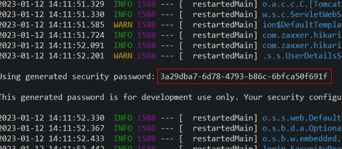
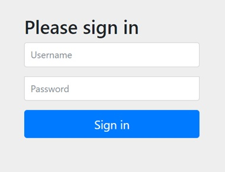

# はじめに

SpringBootの開発ではユーザー認証の機能を導入するために、SpringSecurityというフレームワークを導入します。本資料ではカスタマイズしたSpringSecurityの実装例を元に、実装の手順について説明しています。実行については、以下の環境で動作確認済みです。

## 環境
* OS: Windows10
* Javaのバージョン：11
* SpringBootのバージョン：2.7.8(SNAPSHOT)
* データベース：MySQL、MyBatis

## 基本設定（データベースを使わないログイン機能の実装）
### pom.xmlの編集
以下のライブラリを３つ追加するようにしましょう。
```xml:pom.xml
<dependency>
    <groupId>org.springframework.security</groupId>
    <artifactId>spring-security-test</artifactId>
    <scope>test</scope>
</dependency>
<dependency>
    <groupId>org.thymeleaf.extras</groupId>
    <artifactId>thymeleaf-extras-springsecurity5</artifactId>
</dependency>
<dependency>
    <groupId>org.springframework.boot</groupId>
    <artifactId>spring-boot-starter-security</artifactId>
</dependency>
```
### プロジェクトの更新
追加したら、プロジェクトを更新しましょう。反映されたら、プロジェクトを一度実行します。するとコンソールに以下のように表示されます。コンソールのsecurity passwordの赤四角で囲んでいる部分をコピーしておいてください。プロジェクトを起動するたびに、この文字列は変化します。



### ログイン画面を表示
実行したら、早速、http://127.0.0.1:8080/login
にアクセスしてみてください。Springが用意しているログイン画面が表示されます。
Usernameにuserと入力し、Passwordに先ほどの画面でコピーしたパスワードを入力してください。そうすると、http://127.0.0.1:8080
にアクセスされると思います。ログインが完了することを確認できました。ここで特にコントローラーなどで何も設定していない場合は、Whitelabel Error Pageが表示されます。



# ログイン認証のカスタマイズ

ここから以下のカスタマイズを含む実装について、紹介します。  
* 独自のログインページを用意
* ログイン後は/homeに遷移
* CSRFは対応しない
* 独自のusersテーブルとauthoritiesテーブルを使って認証
* ログインユーザ情報に独自パラメータnicknameを追加
* ログインエラー時にエラーメッセージを表示

## 独自のログインページの表示
## ログイン後に/homeに遷移
## CSRFは対応しない

まずは上３つのカスタマイズについて確認していきます。ここでは独自のログインページをどうやって表示するか、ログイン完了後にどのページに飛ばすか、ページの素材となるファイルへのアクセスはどうやって許可するかなど独自の設定をしていきましょう。

このセクションでは、以下のファイルを作成及び更新します。
* SecurityConfig.java
* LoginCOntroller.java
* login.html
* home.html

### SecurityConfig.javaを作成

```java:SecurityConfig.java
@Configuration
public class SecurityConfig {
    @Autowired
    private DataSource dataSource;
    @Autowired
    private UserDetailsService userDetailsService;
    // ログイン後は/homeに遷移させる
    @Bean
    public SecurityFilterChain filterChain(HttpSecurity http) throws Exception {
        // csrf認証は使わない
        http.csrf().disable();
        http.headers().frameOptions().disable();
        //　cssなどのリソースファイルにはログイン無しでもアクセスが可能
        http.authorizeHttpRequests(authz -> authz
            .requestMatchers(PathRequest.toStaticResources().atCommonLocations()).permitAll()
            .mvcMatchers("/").permitAll() // ログインなしでもアクセス可能なページ
            .antMatchers("/h2-console/**").permitAll() // ログインなしでもアクセス可能なページパターン
            .mvcMatchers("/general").hasRole("GENERAL") // 権限GENERALがアクセス可能
            .mvcMatchers("/admin").hasRole("ADMIN") // 権限ADMINがアクセス可能
            .anyRequest().authenticated() // 他のURLについてはログイン後にアクセスが可能となる
        );
        // ログインでの認証成功・失敗時の処理の記述
        http.formLogin(form -> form
    		.loginProcessingUrl("/login")
        	.loginPage("/login")
            .defaultSuccessUrl("/home")
            .failureUrl("/login?error")
            .permitAll()
        );
        // ログアウト時の処理の記述
        http.logout(logout -> logout
        	.logoutUrl("/logout")
        	.logoutSuccessUrl("/login")
        );
        System.out.println(this.dataSource);
        return http.build();
    }
}

```

### LoginController.javaを作成

```java:LoginController.java
@Controller
public class LoginController {
	@GetMapping("/login")
	public String login() {
        return "login";
	}
	@GetMapping("/home")
	public String home() {
		return "home";
	}
}
```

### login画面の作成

```html:login.html
<!DOCTYPE html>
<html xmlns:th="http://www.thymeleaf.org">
    <head>
        <meta charset="utf-8">
    </head>
    <body>
        <h1 class="text-center">ログイン</h1>
        <form method="post" th:action="@{/login}">
            <input type="text" placeholder="ユーザーID" name="username" id="username"/>
            <input type="text" placeholder="パスワード" name="password" id="password"/>
            <input type="submit" value="ログイン"/>
        </form>
    </body>
</html>
```

### home画面の作成

```html:home.html
<!DOCTYPE html>
<html xmlns:th="http://www.thymeleaf.org">
    <head>
        <meta charset="utf-8">
    </head>
    <body>
        <h1>Home</h1>
        <a href="logout">Logout</a>
    </body>
</html>
```

http://127.0.0.1:8080/login
にアクセスしてみてください。作成したlogin.htmlの画面が表示されると思います。同じようにユーザー名とパスワードを入力し、以下のような画面が表示されていれば完成です。


## 独自のusersテーブルとauthoritiesテーブルを使って認証

データベースに登録しているユーザー情報からユーザー認証を行うために、まずはデータベースにテーブルを作成し、データを登録します。ユーザー情報のnicknameは後から出てくるユーザー情報の拡張の際に使います。

このセクションでは、以下のテーブル、ファイルを作成及び更新します。
* user(テーブル)
* authorities(テーブル)
* SecurityConfig.java:修正
* LoginController.java:修正

### userテーブルの作成
テーブルの構成は以下の通りです。
<table>
    <tr>
        <th>COLUMN_NAME</th><th>DATA_TYPE(SIZE)</th><th>ATTRIBUTES</th>
    </tr>
    <tr>
        <td>id</td><td>INT</td><td><ul><li>PrimaryKey</li><li>NotNull</li><li>AutoIncrement</li></ul></td>
    </tr>
    <tr>
        <td>username</td><td>VARCHAR(45)</td><td><ul><li>Unique</li>
        <li>NotNull</li></ul></td>
    </tr>
    <tr>
        <td>password</td><td>VARCHAR(255)</td><td><ul><li>NotNull</li></ul></td>
    </tr>
    <tr>
        <td>nickname</td><td>VARCHAR(45)</td><td></td>
    </tr>
</table>

### authoritiesテーブルの作成
テーブルの構成は以下の通りです。
<table>
    <tr>
        <th>COLUMN_NAME</th><th>DATA_TYPE(SIZE)</th><th>ATTRIBUTES</th>
    </tr>
    <tr>
        <td>username</td><td>VARCHAR(45)</td><td><ul><li>PrimaryKey</li><li>NotNull</li></ul></td>
    </tr>
    <tr>
        <td>authority</td><td>VARCHAR(45)</td><td><ul><li>NotNull</li></ul></td>
    </tr>
</table>

### ハッシュ化されたパスワードを取得
SpringSecurityではパスワードはハッシュ化して登録します。そのためLoginControllerの中身を一部修正して、ハッシュ化したパスワードをコンソール画面に表示するようにしましょう。
```java:LoginController.java
@GetMapping("/login")
public String login() {
    // encodeメソッドの引数にハッシュ化したいパスワードの文字を入力します。
    String pass = PasswordEncoderFactories.createDelegatingPasswordEncoder().encode("password");
    System.out.println(pass);
    return "login";
}
```
http://127.0.0.1:8080/login
にアクセスしてみてください。以下のように、コンソール画面にハッシュ化された文字列が出力されます。ここでは、passwordという文字をハッシュ化した文字列を例示します。

<b>{bcrypt}$2a$10$M5JloOG9EyThd3s/2xocKOU3ojKF5dlMvZnh/tAEbuDHBGrWAfWWa</b>

### ログインに必要なデータを入力します
userテーブル
<table>
    <tr>
        <th>COLUMN_NAME</th><th>VALUE</th>
    </tr>
    <tr>
        <th>id</th><td>1</td>
    </tr>
    <tr>
        <th>username</th><td>user1</td>
    </tr>
    <tr>
        <th>password</th><td>{bcrypt}$2a$10$M5JloOG9EyThd3s/2xocKOU3ojKF5dlMvZnh/tAEbuDHBGrWAfWWa</td>
    </tr>
    <tr>
        <th>nickname</th><td>nick</td>
    </tr>
</table>

authorityテーブル
<table>
    <tr>
        <th>COLUMN_NAME</th><th>VALUE</th>
    </tr>
    <tr>
        <th>username</th><td>user1</td>
    </tr>
    <tr>
        <th>authority</th><td>GENERAL</td>
    </tr>
</table>

### データベースを使ってログイン
ここまでで、データベースの準備ができました。プロジェクトがデータベースを参照して、認証するようにSecurityConfig.javaの内容を修正しましょう。

#### SecurityConfig.javaを修正

```java:SecurityConfig.java
@Configuration
public class SecurityConfig {
    @Autowired
    private DataSource dataSource;
    // ログイン後は/homeに遷移させる
    @Bean
    public SecurityFilterChain filterChain(HttpSecurity http) throws Exception {
       ．．．省略
    }
    // データベースと連携してログイン処理を行う
    @Bean
    public UserDetailsManager users(DataSource dataSource){
    	// ログイン処理が開始したら入力されたユーザー名を元にデータを取得する
    	String USERQUERY = "select username,password,'1' from users where username = ?";
    	// 権限についてユーザー名を元にデータを取得する
    	String AUTHQUERY = "select username,authority from authorities where username = ?";
    	JdbcUserDetailsManager users = new JdbcUserDetailsManager(dataSource);
    	users.setUsersByUsernameQuery(USERQUERY);
    	users.setAuthoritiesByUsernameQuery(AUTHQUERY);
    	return users;
    }
}
```

ここまでで設定は終了です。ログイン画面にアクセスして、データベースに入力したユーザー名とパスワード（パスワードはハッシュ化前の値）を入力してログインしてみましょう。

#### ユーザー情報を取得するために、LoginController.javaを編集する
```java:LoginController.java
@Controller
public class LoginController {
    @GetMapping("/login")
    public String login() {
        return "login";
    }
    @GetMapping("/home")
    public String home(@AuthenticationPrincipal UserDetails user) {
        System.out.println(user.getUsername());
        return "home";
    }
}
```

## ログインユーザ情報に独自パラメータnicknameを追加
## ログインエラー時にエラーメッセージを表示

今のままでもログインのためのユーザー情報(ユーザー名、パスワード)を取得することはできますが、nicknameなどの自分で設定したカラムの値は取得できません。これらの値を取得できるようにするためには、認証用のクラスをカスタマイズする必要があります。

このセクションでは、以下のファイルを作成及び更新します。
* UserMapper.xml
* UserMapper.java
* LoginUser.java
* UserService.java
* UserDetailsServiceImpl.java
* SecurityConfig.java
* LoginController.java

### ユーザー情報を取得するための仕組みを作る
#### UserMapper.xmlを作成する
application.propertiesの設定で適用されている場所に、xmlファイルを用意します。以下のように編集して保存してください。namespaceの値はご自身の環境に合わせて書き換えて下さい。

```xml:UserMapper.xml
<?xml version="1.0" encoding="UTF-8"?>
<!DOCTYPE mapper PUBLIC "-//mybatis.org//DTD Mapper 3.0//EN"
"http://mybatis.org/dtd/mybatis-3-mapper.dtd">
<!-- Mapperとxmlのマッピング -->
<mapper namespace="login.repository.UserMapper">
	<select id="findUser" resultType="LoginUser">
		select
			id,password,u.username,nickname,authority
		from
			users as u
			JOIN authorities as a
				ON u.username = a.username
		where
			u.username = #{name}
	</select>
</mapper>
```

#### UserMapper.javaを作成する
xmlに対応するMapperクラス、UserMapper.javaを作成します。
```java:UserMapper.java
@Mapper
public interface UserMapper {
	public LoginUser findUser(String username);
}
```
#### LoginUser.javaを作成する
SpringSecurityの中のUserDetailsインターフェースを実装したLoginUserクラスを作成します。
```java:LoginUser.java
@Data
public class LoginUser implements UserDetails{
	private static final long serialVersionUID = 1L;
	private int id;
	private String username;
	private String password;
	private String nickname;
	private String authority;
	private Collection<GrantedAuthority> authorities;

	@Override
	public Collection<? extends GrantedAuthority> getAuthorities() {
		if (authorities != null) {
			return authorities;
		}
		GrantedAuthority auth = new SimpleGrantedAuthority(authority);
		authorities = new ArrayList<>();
		authorities.add(auth);
		return authorities;
	}

	@Override
	public String getUsername() {
		return username;
	}

	@Override
	public boolean isAccountNonExpired() {
		return true;
	}

	@Override
	public boolean isAccountNonLocked() {
		return true;
	}

	@Override
	public boolean isCredentialsNonExpired() {
		return true;
	}

	@Override
	public boolean isEnabled() {
		return true;
	}

	public String getNickName() {
		return nickname;
	}
}
```
#### UserService.javaを作成する
mapperを介してデータを取得するUserServiceインターフェースを作成します。
```java:UserService.java
public interface UserService {
	public LoginUser getLoginUser(String username);
}
```
### UserServiceImpl.javaを作成する
UserServiceインターフェースを実装するUserServiceImplクラスを作成します。
```java:UserServiceImpl.java
@Service
public class UserServiceImpl implements UserService{
	@Autowired
	private UserMapper mapper;
	@Override
	public LoginUser getLoginUser(String username) {
		return mapper.findUser(username);
	}
}
```
ここまでで、データベースからカスタマイズしたUser情報を取得することができるようになりましたが、カスタマイズされた情報でも認証を行えるように既存のクラスを拡張していきます。

### 認証機能のカスタマイズ
#### UserDetailsServiceImpl.javaを作成する
loginUserが見当たらなかった場合は、エラーを返すようにしています。
```java:UserDetailsServiceImpl.java
@Service
public class UserDetailsServiceImpl implements UserDetailsService {
	@Autowired
	private UserService service;
	@Override
	public UserDetails loadUserByUsername(String username) throws UsernameNotFoundException{
		LoginUser loginUser = service.getLoginUser(username);
		if(loginUser == null) {
			throw new UsernameNotFoundException("");
		}
		return loginUser;
	}
}
```
##### SecurityConfig.javaを編集
今まではSecurityConfigに書いたusersメソッドで認証に使うデータを取得していましたが、カスタマイズしたクラスで得たデータをもとに認証する必要があるので、usersメソッドをコメントアウトしてしまいましょう。
```java:SecurityConfig.java
// データベースと連携してログイン処理を行う
//     @Bean
//     public UserDetailsManager users(DataSource dataSource){
//  	// ログイン処理が開始したら入力されたユーザー名を元にデータを取得する
//    	String USERQUERY = "select username,password,enabled from users where username = ?";
//    	// 権限についてユーザー名を元にデータを取得する
//    	String AUTHQUERY = "select username,'GENERAL' from authorities where username = ?";
//    	JdbcUserDetailsManager users = new JdbcUserDetailsManager(dataSource);
//    	users.setUsersByUsernameQuery(USERQUERY);
//    	users.setAuthoritiesByUsernameQuery(AUTHQUERY);
//    	return users;
//    }
```
#### LoginController.javaを編集
ここまでで、User情報を拡張したLoginUserの準備ができています。Controllerから確認できるように一部編集してみます。/homeへのアクセス時の処理を以下のように書き換えて、ユーザーのニックネームが取得できているか、コンソールから確認してみましょう。
またログインエラー時にエラーメッセージが表示されるように編集しています。
```java:LoginController.java
@Controller
public class LoginController {
	@GetMapping("/login")
	public String login(@RequestParam(value = "error", required = false) String error,
    		Model model, HttpSession session) {
    	if (error != null) {
    		AuthenticationException ex = (AuthenticationException) session.getAttribute(WebAttributes.AUTHENTICATION_EXCEPTION);
    		if (ex != null) {
    			System.out.println(ex);
    			model.addAttribute("showErrorMsg", true);
    			model.addAttribute("errorMsg", ex.getMessage());
    		}
    	}
		return "login";
	}
	@GetMapping("/home")
	public String home(@AuthenticationPrincipal LoginUser user) {
		System.out.println(user);
		return "home";
	}
}
```
#### login.htmlを編集
ログイン時にエラーがあった場合、エラーメッセージが表示されるように以下のように編集します。以上で、ログイン認証機能のカスタマイズが終わります。
```html:login.html
<!DOCTYPE html>
<html xmlns:th="http://www.thymeleaf.org">
	<head>
		<meta charset="utf-8">
	</head>
	<body>
		<h1 class="text-center">ログイン</h1>
		<div th:if="${showErrorMsg}" th:text="${errorMsg}"></div>
		<form method="post" th:action="@{/login}" class="form-login">
			<input type="text" class="form-control" placeholder="ユーザーID" name="username" id="username"/>
			<input type="text" class="form-control" placeholder="パスワード" name="password" id="password"/>
			<input type="submit" value="ログイン"/>
		</form>
	</body>
</html>
```